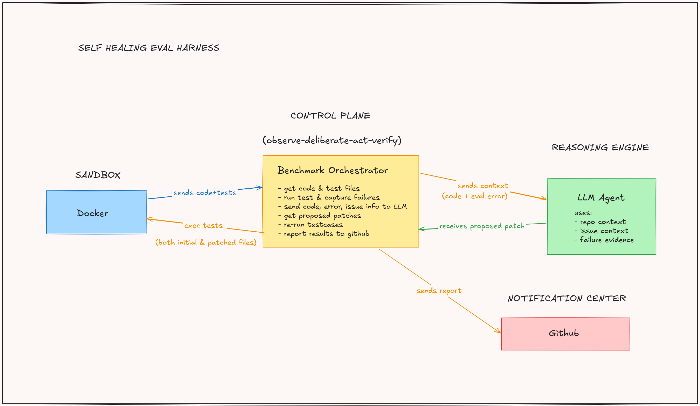

# mini-benchmark

understanding swe-bench architecture by building a tiny, deliberately broken version of it.

## what is this

a self-healing todo-app. i broke it on purpose, wrote testcases that expose exactly how it's broken, raised github issues on my own bugs, and built an orchestrator that watches those issues, sends the bug to an llm agent, and lets it try to patch its way out.

no manual fixing. no me eyeballing diffs. the harness runs on `observe → deliberate → act → verify`, same loop swe-bench uses to grade coding agents, just scoped down to something i could build and actually understand end to end.

## architecture



## the flow

1. **plant the bug** — a small express todo-app (`app/app.js`) has a bug baked in on purpose.
2. **write the trap** — jest + supertest testcases (`tests/todo.test.js`) that fail because of that bug.
3. **raise the issue** — open a github issue describing the bug, same way anyone would report it in the wild.
4. **orchestrator wakes up** — `evals/benchmark.py` spins up a fresh docker container, pulls the current app + test code, runs the test suite, and captures the failure.
5. **agent gets called in** — the failure, the issue title/description, and the code get sent to an llm (two-phase: diagnose the root cause first, then generate a patch). the model responds with structured file blocks — no chat, no explanations, just code.
6. **patch gets applied** — orchestrator parses the file blocks and writes them straight into the container.
7. **verify** — re-runs the test suite inside the same container.
8. **report** — posts the verdict back as a comment on the original github issue: what the agent changed, and whether tests actually passed after.

the docker sandbox + test suite are the immutable judge. the llm is just the one attempting the fix. the orchestrator is the control plane running the whole loop.

## stack

- **app**: node.js, express
- **tests**: jest, supertest
- **sandbox**: docker
- **orchestrator**: python (`docker` sdk, `openai` sdk)
- **trigger**: github actions, fires on issue open 
- **reporting**: github issues api (comments posted via REST)

## running it

```bash
# build the sandbox image
docker build -t mini-benchmark .

# install orchestrator deps
pip install -r requirements.txt

# set env vars
export OPENAI_API_KEY=...
export GITHUB_TOKEN=...
export GITHUB_REPOSITORY=owner/repo
export ISSUE_NUMBER=<issue-number>

# run the harness
python3 evals/benchmark.py
```

or just open an issue on the repo — `.github/workflows/benchmark.yml` handles the rest via github actions.

## why i built this

my class covered swe-bench architecture this week and instead of just nodding along, i wanted a version i could actually poke at, break, and rebuild until the "observe-deliberate-act-verify" loop stopped being a phrase and started being something i could point to in my own code.

turns out the eval loop isn't magic. it's a sandbox, a judge (the tests), and something willing to take a swing at the fix. everything else is scaffolding.

## notes 

- file writes go through base64 encode/decode into the container instead of raw shell echo — avoids quote/backtick/`$` issues from arbitrary source code breaking the write.
- the regex parser for `FILE:` / `END_FILE` blocks is doing a lot of trust-the-model work. if the llm doesn't follow format, the patch silently doesn't apply.
- one bug, one issue, one container lifecycle at a time — no batching yet.